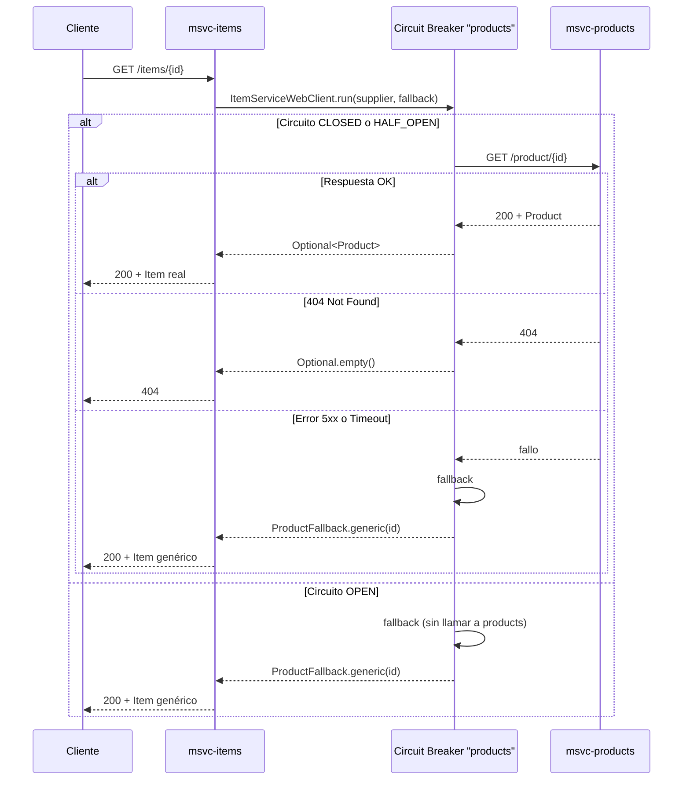
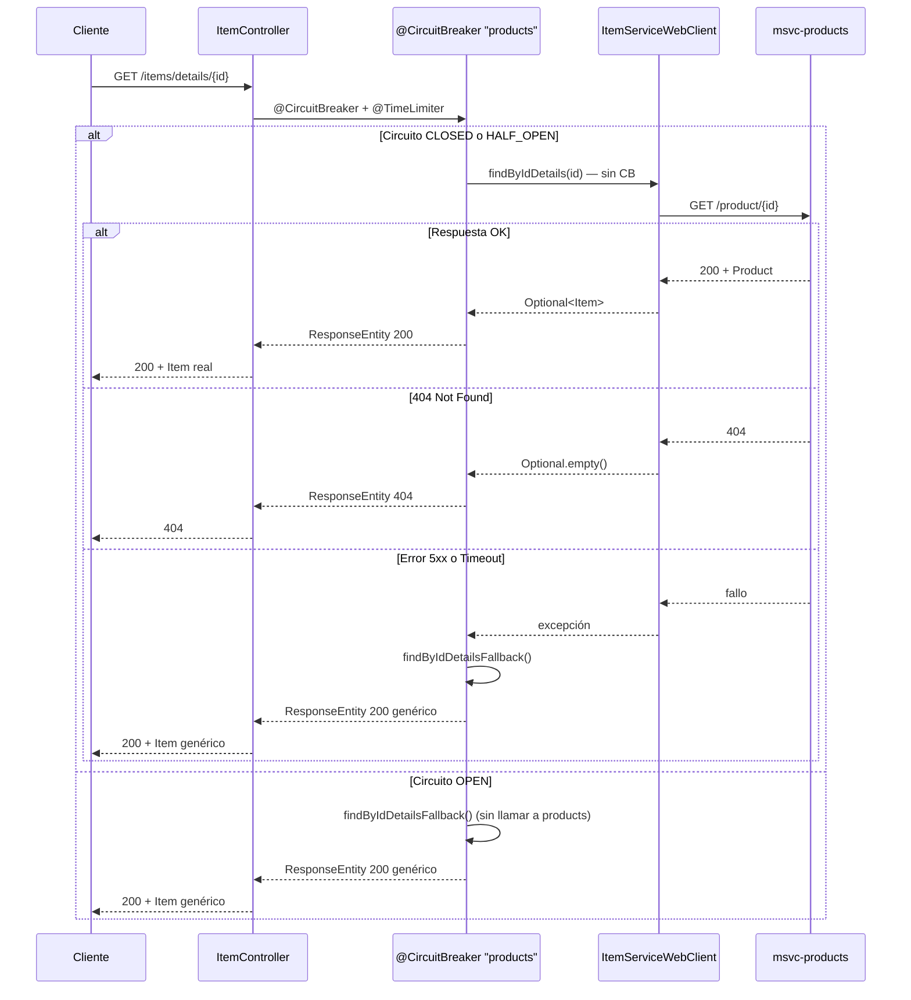

# Circuit Breaker en msvc-items

Documentación del comportamiento actual del **Circuit Breaker** con **Resilience4j** y **Spring Cloud Circuit Breaker**, aplicado a las llamadas de `msvc-items` hacia `msvc-products`.

---

## Resumen

`msvc-items` consume el microservicio `msvc-products` mediante **WebClient** (implementación activa `@Primary`). Las llamadas remotas están protegidas por un circuit breaker llamado **`products`**.

Cuando la llamada a products **falla** o el circuito está **abierto**, el circuit breaker ejecuta un **fallback** que devuelve un **producto genérico**. El controller responde **200 OK** con ese item de respaldo.

Hay **dos formas** de aplicar el mismo circuit breaker (`products`), con el mismo fallback y la misma configuración en `application.yml`:

| Enfoque | Endpoint | Dónde vive el CB |
|---|---|---|
| **Programático** | `GET /items/{id}` | `ItemServiceWebClient` (`CircuitBreakerFactory.run`) |
| **Declarativo** | `GET /items/details/{id}` | `ItemController` (`@CircuitBreaker` + `@TimeLimiter`) |

`ProductClient` es solo HTTP (WebClient); **no** contiene lógica de resiliencia.

---

## Arquitectura

### Enfoque programático — `GET /items/{id}`

```text
ItemController.findById()
    └── ItemServiceWebClient.findById()          ← Circuit Breaker aquí
            ├── supplier  → ProductClient → WebClient → msvc-products
            └── fallback  → ProductCircuitBreakerFallback
                                  └── ProductFallback.generic(id)
```

### Enfoque declarativo — `GET /items/details/{id}`

```text
ItemController.findByIdDetails()               ← @CircuitBreaker + @TimeLimiter aquí
    ├── supplier  → ItemServiceWebClient.findByIdDetails() → ProductClient → msvc-products
    └── fallback  → findByIdDetailsFallback() → ProductCircuitBreakerFallback
                                                          └── ProductFallback.generic(id)
```

> `findByIdDetails()` en el servicio **no** envuelve la llamada con circuit breaker, para que el decorador del controller reciba el fallo y pueda ejecutar el fallback.

### Archivos involucrados

| Archivo | Rol |
|---|---|
| `clients/ProductClient.java` | Cliente HTTP con WebClient; define la constante `CIRCUIT_BREAKER_NAME = "products"` |
| `services/ItemServiceWebClient.java` | CB programático en `findById` y `findAll`; `findByIdDetails` sin CB |
| `controllers/ItemController.java` | CB declarativo en `findByIdDetails` (`@CircuitBreaker`, `@TimeLimiter`) |
| `resilience/ProductCircuitBreakerFallback.java` | Fallback compartido por ambos enfoques |
| `resilience/ProductFallback.java` | Construye el producto genérico de respaldo |
| `resources/application.yml` | Configuración Resilience4j (instancia `products`) + time limiter activo |

Implementación alternativa con **Feign** (`ItemServiceFeign`): mismo circuit breaker `"products"` vía `CircuitBreakerFactory` en `findById` / `findAll`; `findByIdDetails` sin CB (para el endpoint declarativo del controller).

---

## Dos formas de aplicar el Circuit Breaker

### 1. Programático (`CircuitBreakerFactory`)

Usado en `ItemServiceWebClient` para `findById` y `findAll`:

```java
circuitBreakerFactory.create(ProductClient.CIRCUIT_BREAKER_NAME).run(
        () -> productClient.findById(id).map(product -> new Item(product, QUANTITY)),
        throwable -> circuitBreakerFallback.findItemById(id, QUANTITY, throwable));
```

- Integra **circuit breaker + time limiter** en llamadas síncronas.
- La configuración de `application.yml` se aplica automáticamente al nombre `"products"`.
- No requiere anotaciones ni AOP.

### 2. Declarativo (`@CircuitBreaker`)

Usado en `ItemController.findByIdDetails`:

```java
@CircuitBreaker(name = ProductClient.CIRCUIT_BREAKER_NAME, fallbackMethod = "findByIdDetailsFallback")
@TimeLimiter(name = ProductClient.CIRCUIT_BREAKER_NAME)
@GetMapping("/details/{id}")
public ResponseEntity<Item> findByIdDetails(@PathVariable Long id) { ... }
```

- El `name` debe coincidir con la instancia en `application.yml` (`products`).
- `fallbackMethod` apunta a un método **en la misma clase** con la misma firma + `Throwable` al final.
- Requiere `spring-boot-starter-aspectj` (Spring Boot 4; sustituye al antiguo `spring-boot-starter-aop`).

---

## Flujo de una petición `GET /items/{id}` (programático)



---

## Flujo de una petición `GET /items/details/{id}` (declarativo)



---

## Estados del Circuit Breaker

Resilience4j maneja tres estados:

| Estado | Comportamiento |
|---|---|
| **CLOSED** | Las llamadas pasan a `msvc-products`. Los fallos se registran en la ventana deslizante. |
| **OPEN** | Las llamadas **no** llegan a products. Se ejecuta el fallback directamente (`CallNotPermittedException`). |
| **HALF_OPEN** | Tras el tiempo de espera, permite llamadas de prueba. Si tienen éxito → CLOSED; si fallan → OPEN. |

### Cuándo se abre el circuito

Configuración actual en `application.yml`:

```yaml
resilience4j:
  circuitbreaker:
    instances:
      products:
        slidingWindowSize: 10
        minimumNumberOfCalls: 5
        failureRateThreshold: 50
        waitDurationInOpenState: 10s
        slowCallDurationThreshold: 3s
```

| Propiedad | Valor | Significado |
|---|---|---|
| `slidingWindowSize` | 10 | Evalúa las últimas 10 llamadas |
| `minimumNumberOfCalls` | 5 | No abre el circuito hasta acumular al menos 5 llamadas |
| `failureRateThreshold` | 50 | Se abre si ≥ 50% de las llamadas en la ventana fallaron |
| `waitDurationInOpenState` | 10s | Permanece OPEN durante 10 segundos antes de pasar a HALF_OPEN |

**Ejemplo práctico:** 5 llamadas consecutivas a `/items/10` (todas fallan) → tasa de fallo 100% → circuito **OPEN** en la siguiente evaluación.

> Resilience4j no usa un contador fijo de "N fallos". Calcula la **tasa de fallos** sobre la ventana deslizante.

---

## Time Limiter (timeout)

Además del circuit breaker, hay un **time limiter** de 3 segundos:

```yaml
spring:
  cloud:
    circuitbreaker:
      resilience4j:
        disable-time-limiter: false

resilience4j:
  timelimiter:
    instances:
      products:
        timeoutDuration: 3s
        cancelRunningFuture: true
```

Spring Cloud Circuit Breaker + Resilience4j lee estas propiedades automáticamente; no hace falta un `@Configuration` Java para valores numéricos o duraciones. En el enfoque declarativo, `@TimeLimiter(name = "products")` usa la misma instancia.

Si la llamada a products supera 3 segundos, se cancela y el circuit breaker ejecuta el **fallback**.

---

## Casos de prueba

> Los casos **CP-01 a CP-08** usan `GET /items/{id}` (enfoque programático). El comportamiento es equivalente en `GET /items/details/{id}` (enfoque declarativo); sustituye la URL en los comandos `curl` para validar el decorador `@CircuitBreaker`.

Base URL de items: `http://localhost:8002`

### Prerrequisitos

1. Eureka en `http://localhost:8761`
2. `msvc-products` registrado en Eureka
3. `msvc-items` en el puerto **8002**
4. Al menos un producto válido en BD (por ejemplo id **1**)

Para resetear el estado del circuit breaker entre sesiones de prueba, reinicia `msvc-items`.

---

### CP-01 — CLOSED: respuesta exitosa (item real)

| Campo | Valor |
|---|---|
| **Estado CB** | CLOSED |
| **Objetivo** | Verificar flujo normal sin fallback |
| **Petición** | `GET http://localhost:8002/items/1` |
| **HTTP esperado** | `200 OK` |
| **Body esperado** | Item real con datos de BD (`category` ≠ `"fallback"`) |
| **Log items** | Sin mensajes de fallback |
| **Log products** | Query Hibernate normal |

```bash
curl -i http://localhost:8002/items/1
```

---

### CP-02 — CLOSED: producto inexistente (404 sin fallback)

| Campo | Valor |
|---|---|
| **Estado CB** | CLOSED |
| **Objetivo** | Un 404 real de products **no** activa el fallback |
| **Petición** | `GET http://localhost:8002/items/99999` |
| **HTTP esperado** | `404 Not Found` |
| **Body esperado** | Vacío (sin item genérico) |
| **Log items** | Sin mensajes de fallback |

```bash
curl -i http://localhost:8002/items/99999
```

---

### CP-03 — CLOSED: error upstream simulado (id=10)

| Campo | Valor |
|---|---|
| **Estado CB** | CLOSED |
| **Objetivo** | products responde 500 → fallback del CB |
| **Petición** | `GET http://localhost:8002/items/10` |
| **HTTP esperado** | `200 OK` |
| **Body esperado** | Item genérico (`"category": "fallback"`, `"name": "Producto genérico"`) |
| **Tiempo aprox.** | < 1s |
| **Log items** | `Circuit breaker fallback — producto genérico para id=10: ...` |
| **Log products** | Responde 500 controlado (sin stack trace) |

```bash
curl -i http://localhost:8002/items/10
```

---

### CP-04 — CLOSED: timeout simulado (id=7)

| Campo | Valor |
|---|---|
| **Estado CB** | CLOSED |
| **Objetivo** | products tarda 5s, time limiter corta a 3s → fallback |
| **Petición** | `GET http://localhost:8002/items/7` |
| **HTTP esperado** | `200 OK` |
| **Body esperado** | Item genérico (`"category": "fallback"`) |
| **Tiempo aprox.** | ~3 segundos (no 5) |
| **Log items** | `Circuit breaker fallback — producto genérico para id=7: ...` |

```bash
curl -i -w "\nTiempo total: %{time_total}s\n" http://localhost:8002/items/7
```

---

### CP-05 — OPEN: apertura del circuito tras fallos acumulados

| Campo | Valor |
|---|---|
| **Estado CB** | CLOSED → OPEN |
| **Objetivo** | Acumular fallos hasta superar umbral (≥5 llamadas, ≥50% fallos) |
| **Petición** | `GET http://localhost:8002/items/10` repetido **6 veces** |
| **HTTP esperado** | `200 OK` en todas (item genérico) |
| **Log items (intentos 1–5)** | `Circuit breaker fallback — producto genérico para id=10` |
| **Log items (intento 6+)** | `Circuit breaker ABIERTO — producto genérico para id=10` |
| **Diferencia clave** | Tras OPEN, la respuesta es más rápida (no llama a products) |

```bash
for i in {1..6}; do
  echo "--- Intento $i ---"
  curl -s -o /dev/null -w "HTTP %{http_code} en %{time_total}s\n" \
    http://localhost:8002/items/10
done
```

**Criterio de éxito:** a partir del intento 6 aparece el log **ABIERTO** y el tiempo de respuesta baja respecto a los primeros intentos.

---

### CP-06 — HALF_OPEN → CLOSED: recuperación del circuito

| Campo | Valor |
|---|---|
| **Estado CB** | OPEN → HALF_OPEN → CLOSED |
| **Precondición** | CP-05 completado (circuito OPEN) |
| **Paso 1** | Esperar **10 segundos** (`waitDurationInOpenState=10s`) |
| **Paso 2** | `GET http://localhost:8002/items/1` (id válido en BD) |
| **HTTP esperado** | `200 OK` |
| **Body esperado** | Item **real** (no genérico) |
| **Log items** | Sin fallback |
| **Resultado** | CB vuelve a **CLOSED** |

```bash
echo "Esperando 10s para HALF_OPEN..."
sleep 10
curl -i http://localhost:8002/items/1
```

---

### CP-07 — HALF_OPEN → OPEN: fallo en prueba de recuperación

| Campo | Valor |
|---|---|
| **Estado CB** | OPEN → HALF_OPEN → OPEN |
| **Precondición** | CP-05 completado + esperar 10s |
| **Petición** | `GET http://localhost:8002/items/10` |
| **HTTP esperado** | `200 OK` (item genérico) |
| **Log items** | Fallback activado de nuevo |
| **Resultado** | CB regresa a **OPEN** por fallo en half-open |

```bash
sleep 10
curl -i http://localhost:8002/items/10
```

---

### CP-08 — OPEN: llamada con circuito abierto (cualquier id)

| Campo | Valor |
|---|---|
| **Estado CB** | OPEN |
| **Precondición** | CP-05 completado, sin esperar recuperación |
| **Petición** | `GET http://localhost:8002/items/1` |
| **HTTP esperado** | `200 OK` |
| **Body esperado** | Item genérico (aunque el id exista en BD) |
| **Log items** | `Circuit breaker ABIERTO — producto genérico para id=1` |
| **Nota** | Con circuito OPEN, **no** se consulta products |

```bash
curl -i http://localhost:8002/items/1
```

---

### CP-09 — findAll: error sin fallback genérico

| Campo | Valor |
|---|---|
| **Estado CB** | CLOSED |
| **Objetivo** | Verificar que `findAll` **no** devuelve item genérico |
| **Precondición** | Detener `msvc-products` o provocar error en listado |
| **Petición** | `GET http://localhost:8002/items` |
| **HTTP esperado** | `502`, `504` o `503` (según tipo de fallo) |
| **Body esperado** | `{"error":"..."}` |
| **Nota** | Solo `findById` usa fallback genérico; `findAll` propaga excepción |

```bash
curl -i http://localhost:8002/items
```

---

### Matriz resumen de casos

| Caso | Endpoint | Estado CB | HTTP | ¿Fallback? | Identificador en body |
|---|---|---|---|---|---|
| CP-01 | `/items/1` | CLOSED | 200 | No | Datos reales de BD |
| CP-02 | `/items/99999` | CLOSED | 404 | No | — |
| CP-03 | `/items/10` | CLOSED | 200 | Sí | `"category": "fallback"` |
| CP-04 | `/items/7` | CLOSED | 200 | Sí (~3s) | `"category": "fallback"` |
| CP-05 | `/items/10` ×6 | CLOSED→OPEN | 200 | Sí | Log **ABIERTO** |
| CP-06 | `/items/1` tras 10s | HALF_OPEN→CLOSED | 200 | No | Datos reales |
| CP-07 | `/items/10` tras 10s | HALF_OPEN→OPEN | 200 | Sí | Item genérico |
| CP-08 | `/items/1` con CB OPEN | OPEN | 200 | Sí | Item genérico |
| CP-09 | `/items` sin products | CLOSED | 5xx | No (excepción) | `{"error":"..."}` |
| CP-10 | `/items/details/10` | CLOSED | 200 | Sí (declarativo) | `"category": "fallback"` |

---

### CP-10 — Declarativo: fallback vía `@CircuitBreaker` en controller

| Campo | Valor |
|---|---|
| **Enfoque** | Declarativo (`@CircuitBreaker` en `ItemController`) |
| **Estado CB** | CLOSED |
| **Objetivo** | Verificar el decorador en `/items/details/{id}` |
| **Petición** | `GET http://localhost:8002/items/details/10` |
| **HTTP esperado** | `200 OK` |
| **Body esperado** | Item genérico (`"category": "fallback"`) |
| **Log items** | `Circuit breaker fallback — producto genérico para id=10: ...` |

```bash
curl -i http://localhost:8002/items/details/10
```

---

### Orden recomendado (Postman o manual)

Ejecuta los casos en este orden para recorrer todos los estados sin interferencias:

```text
CP-01  →  CP-02  →  CP-03  →  CP-04  →  CP-05  →  CP-08  →  CP-06  →  CP-07
```

CP-09 es independiente (requiere detener products).

---

### Checklist de verificación

- [ ] Item real cuando products responde OK (CP-01)
- [ ] 404 sin fallback cuando el producto no existe (CP-02)
- [ ] Item genérico ante error 500 de products (CP-03)
- [ ] Item genérico ante timeout ~3s (CP-04)
- [ ] Log **ABIERTO** tras acumular fallos (CP-05)
- [ ] Recuperación a item real tras espera de 10s (CP-06)
- [ ] Reapertura del circuito si half-open falla (CP-07)
- [ ] Fallback genérico incluso para ids válidos con CB OPEN (CP-08)
- [ ] Fallback declarativo en `/items/details/{id}` (CP-10)

---

Cuando el circuit breaker activa el fallback, la respuesta tiene esta forma:

```json
{
  "product": {
    "id": 10,
    "name": "Producto genérico",
    "description": "Respuesta de respaldo — servicio products no disponible",
    "price": 0.0,
    "category": "fallback"
  },
  "quantity": 2,
  "total": 0.0
}
```

Identificar fallback: `"category": "fallback"`.

### Datos simulados en msvc-products

`ProductController` expone estos ids especiales para las pruebas:

| ID | Comportamiento en products | Caso de prueba |
|---|---|---|
| **10** | Responde **500** con `{"error":"Producto no encontrado"}` | CP-03, CP-05, CP-07 |
| **7** | `sleep(5s)` antes de responder | CP-04 |
| **Cualquier otro** | Consulta normal a BD | CP-01, CP-02, CP-06 |

---

## Logs

En la consola de `msvc-items` aparecen dos mensajes distintos:

```text
# Fallo en la llamada, circuito aún CLOSED
Circuit breaker fallback — producto genérico para id=10: ...

# Circuito OPEN — no se llama a products
Circuit breaker ABIERTO — producto genérico para id=10
```

---

## Diferencia entre métodos y endpoints

| Método / endpoint | Circuit Breaker | Dónde | Fallback |
|---|---|---|---|
| `ItemServiceWebClient.findById()` → `GET /items/{id}` | Sí | Programático (`CircuitBreakerFactory`) | Item genérico |
| `ItemController.findByIdDetails()` → `GET /items/details/{id}` | Sí | Declarativo (`@CircuitBreaker`) | Item genérico |
| `ItemServiceWebClient.findByIdDetails()` | No | — | Propaga fallos al controller |
| `ItemServiceWebClient.findAll()` → `GET /items` | Sí | Programático | Relanza excepción (502/504/503) |

Solo `findById` y `findByIdDetails` devuelven item genérico ante fallo. `findAll` propaga errores al `ItemExceptionHandler`.

---

## Cómo ajustar la sensibilidad del circuito

Para que se abra con **menos fallos**, por ejemplo tras 3 fallos consecutivos:

```yaml
resilience4j:
  circuitbreaker:
    instances:
      products:
        slidingWindowSize: 3
        minimumNumberOfCalls: 3
        failureRateThreshold: 100
```

Reinicia `msvc-items` después de cambiar propiedades.

---

## Dependencias Maven

```xml
<dependency>
    <groupId>org.springframework.cloud</groupId>
    <artifactId>spring-cloud-starter-circuitbreaker-resilience4j</artifactId>
</dependency>
<!-- Necesario para @CircuitBreaker / @TimeLimiter (Spring Boot 4) -->
<dependency>
    <groupId>org.springframework.boot</groupId>
    <artifactId>spring-boot-starter-aspectj</artifactId>
</dependency>
```

---

## Referencia rápida

```text
Nombre del circuit breaker : "products"  (ProductClient.CIRCUIT_BREAKER_NAME)
Timeout                    : 3 segundos
Mínimo llamadas p/ evaluar : 5
Umbral de fallos           : 50%
Ventana deslizante         : 10 llamadas
Tiempo en OPEN             : 10 segundos
Puerto items               : 8002
Endpoint programático      : GET /items/{id}
Endpoint declarativo       : GET /items/details/{id}
Configuración              : src/main/resources/application.yml
```
