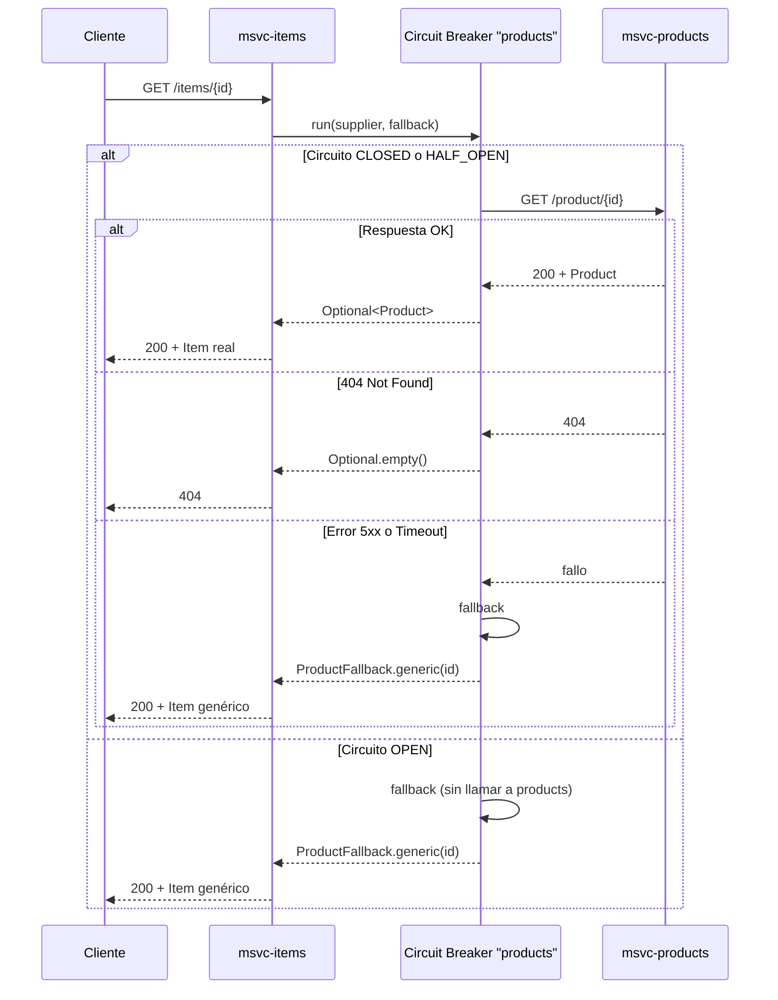

# Circuit Breaker en msvc-items

Documentación del comportamiento actual del **Circuit Breaker** con **Resilience4j** y **Spring Cloud Circuit Breaker**, aplicado a las llamadas de `msvc-items` hacia `msvc-products`.

---

## Resumen

`msvc-items` consume el microservicio `msvc-products` mediante **WebClient** (implementación activa `@Primary`). Las llamadas remotas están protegidas por un circuit breaker llamado **`products`**.

Cuando la llamada a products **falla** o el circuito está **abierto**, el circuit breaker ejecuta un **fallback** que devuelve un **producto genérico**. El controller responde **200 OK** con ese item de respaldo.

El controller **no** contiene lógica de circuit breaker; toda la resiliencia vive en la capa de cliente.

---

## Arquitectura

```text
ItemController
    └── ItemServiceWebClient (@Primary)
            └── ProductClient                    ← Circuit Breaker aquí
                    ├── supplier  → WebClient → msvc-products (Eureka)
                    └── fallback  → ProductCircuitBreakerFallback
                                          └── ProductFallback.generic(id)
```

### Archivos involucrados

| Archivo | Rol |
|---|---|
| `clients/ProductClient.java` | Envuelve las llamadas HTTP con `CircuitBreakerFactory.run()` |
| `resilience/ProductCircuitBreakerFallback.java` | Fallback invocado **solo** por el circuit breaker |
| `resilience/ProductFallback.java` | Construye el producto genérico de respaldo |
| `resources/application.properties` | Única fuente de configuración Resilience4j (instancia `products`) |
| `services/ItemServiceWebClient.java` | Mapea `Product` → `Item` (quantity = 2) |
| `controllers/ItemController.java` | Expone `/items/{id}` — sin lógica de CB |

Implementación alternativa con **Feign** (`ItemServiceFeign`): usa el mismo circuit breaker `"products"` y el mismo fallback.

---

## Flujo de una petición `GET /items/{id}`



---

## Estados del Circuit Breaker

Resilience4j maneja tres estados:

| Estado | Comportamiento |
|---|---|
| **CLOSED** | Las llamadas pasan a `msvc-products`. Los fallos se registran en la ventana deslizante. |
| **OPEN** | Las llamadas **no** llegan a products. Se ejecuta el fallback directamente (`CallNotPermittedException`). |
| **HALF_OPEN** | Tras el tiempo de espera, permite llamadas de prueba. Si tienen éxito → CLOSED; si fallan → OPEN. |

### Cuándo se abre el circuito

Configuración actual en `application.properties`:

```properties
resilience4j.circuitbreaker.instances.products.slidingWindowSize=10
resilience4j.circuitbreaker.instances.products.minimumNumberOfCalls=5
resilience4j.circuitbreaker.instances.products.failureRateThreshold=50
resilience4j.circuitbreaker.instances.products.waitDurationInOpenState=10s
```

| Propiedad | Valor | Significado |
|---|---|---|
| `slidingWindowSize` | 10 | Evalúa las últimas 10 llamadas |
| `minimumNumberOfCalls` | 5 | No abre el circuito hasta acumular al menos 5 llamadas |
| `failureRateThreshold` | 50 | Se abre si ≥ 50% de las llamadas en la ventana fallaron |
| `waitDurationInOpenState` | 10s | Permanece OPEN durante 10 segundos antes de pasar a HALF_OPEN |

**Ejemplo práctico:** 5 llamadas consecutivas a `/items/10` (todas fallan) → tasa de fallo 100% → circuito **OPEN** en la siguiente evaluación.

> Resilience4j no usa un contador fijo de "N fallos". Calcula la **tasa de fallos** sobre la ventana deslizante.

---

## Time Limiter (timeout)

Además del circuit breaker, hay un **time limiter** de 3 segundos:

```properties
resilience4j.timelimiter.instances.products.timeoutDuration=3s
resilience4j.timelimiter.instances.products.cancelRunningFuture=true
```

Spring Cloud Circuit Breaker + Resilience4j lee estas propiedades automáticamente; no hace falta un `@Configuration` Java para valores numéricos o duraciones.

Si la llamada a products supera 3 segundos, se cancela y el circuit breaker ejecuta el **fallback**.

---

## Escenarios de prueba en msvc-products

`ProductController` incluye dos casos simulados para practicar resiliencia:

| ID | Comportamiento en products | Efecto en items |
|---|---|---|
| **10** | Responde **500** con `{"error":"Producto no encontrado"}` | Fallback → item genérico **200** |
| **7** | `sleep(5s)` antes de responder | Timeout a los 3s → fallback → item genérico **200** |
| **Cualquier otro** | Consulta normal a BD | Item real **200** o **404** si no existe |

---

## Respuesta del fallback (item genérico)

Cuando el circuit breaker activa el fallback, la respuesta tiene esta forma:

```json
{
  "product": {
    "id": 10,
    "name": "Producto genérico",
    "description": "Respuesta de respaldo — servicio products no disponible",
    "price": 0.0,
    "category": "fallback"
  },
  "quantity": 2,
  "total": 0.0
}
```

Identificar fallback: `"category": "fallback"`.

---

## Logs

En la consola de `msvc-items` aparecen dos mensajes distintos:

```text
# Fallo en la llamada, circuito aún CLOSED
Circuit breaker fallback — producto genérico para id=10: ...

# Circuito OPEN — no se llama a products
Circuit breaker ABIERTO — producto genérico para id=10
```

---

## Guía de pruebas manual

### Prerrequisitos

1. Eureka en `http://localhost:8761`
2. `msvc-products` registrado en Eureka
3. `msvc-items` en `http://localhost:8002`

### Orden sugerido

| Paso | Petición | Resultado esperado |
|---|---|---|
| 1 | `GET /items/1` | **200** — item real (id válido en BD) |
| 2 | `GET /items/99999` | **404** — sin fallback |
| 3 | `GET /items/10` | **200** — item genérico (error upstream) |
| 4 | `GET /items/7` | **200** — item genérico (~3s, timeout) |
| 5 | `GET /items/10` × 6 | Últimas peticiones con log **ABIERTO** |
| 6 | Esperar 10s | Circuito pasa a HALF_OPEN |
| 7 | `GET /items/1` | **200** — item real (circuito vuelve a CLOSED) |

### Script rápido (terminal)

```bash
# Abrir el circuito
for i in {1..6}; do
  echo "--- Intento $i ---"
  curl -s -o /dev/null -w "HTTP %{http_code} en %{time_total}s\n" \
    http://localhost:8002/items/10
done
```

---

## Diferencia: `findById` vs `findAll`

| Método | Circuit Breaker | Fallback |
|---|---|---|
| `ProductClient.findById()` | Sí | Item genérico vía `ProductCircuitBreakerFallback` |
| `ProductClient.findAll()` | Sí | Relanza excepción vía `ProductServiceErrorHandler` (502/504/503) |

Solo `findById` tiene fallback con producto genérico. `findAll` propaga errores al `ItemExceptionHandler`.

---

## Cómo ajustar la sensibilidad del circuito

Para que se abra con **menos fallos**, por ejemplo tras 3 fallos consecutivos:

```properties
resilience4j.circuitbreaker.instances.products.slidingWindowSize=3
resilience4j.circuitbreaker.instances.products.minimumNumberOfCalls=3
resilience4j.circuitbreaker.instances.products.failureRateThreshold=100
```

Reinicia `msvc-items` después de cambiar propiedades.

---

## Dependencia Maven

```xml
<dependency>
    <groupId>org.springframework.cloud</groupId>
    <artifactId>spring-cloud-starter-circuitbreaker-resilience4j</artifactId>
</dependency>
```

---

## Referencia rápida

```text
Nombre del circuit breaker : "products"
Timeout                    : 3 segundos
Mínimo llamadas p/ evaluar : 5
Umbral de fallos           : 50%
Ventana deslizante         : 10 llamadas
Tiempo en OPEN             : 10 segundos
Puerto items               : 8002
Endpoint                   : GET /items/{id}
```
